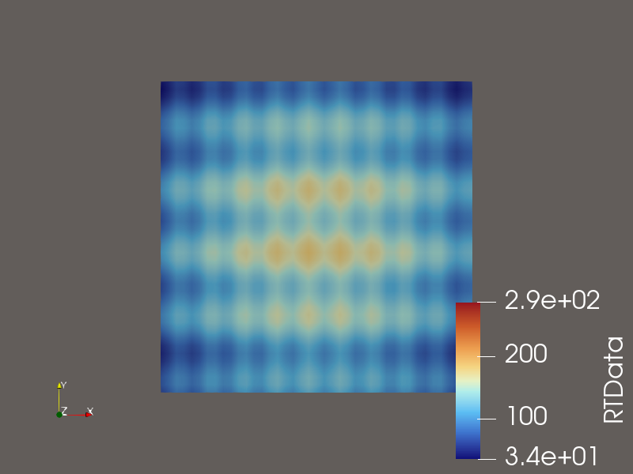
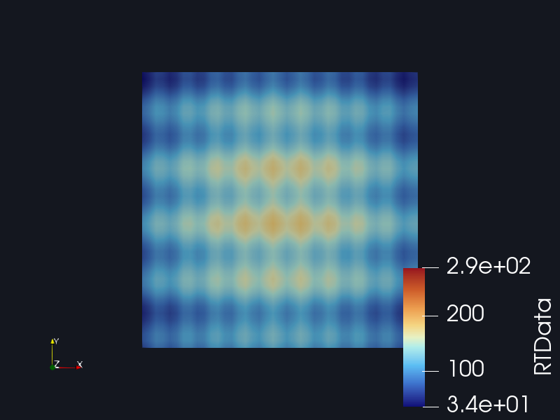
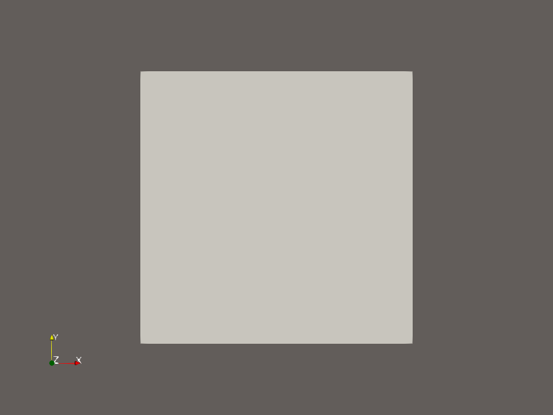
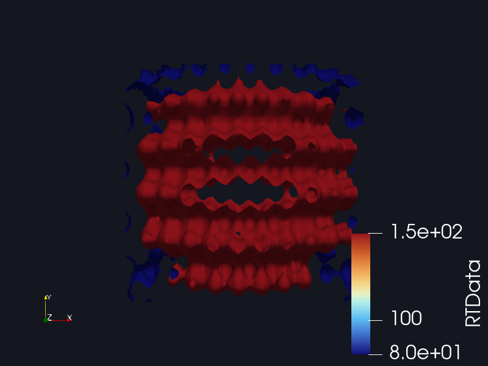
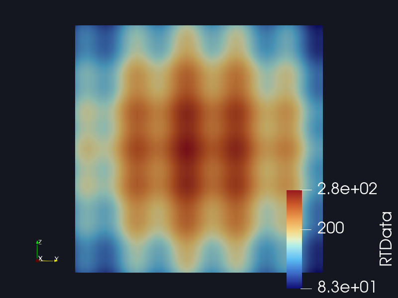
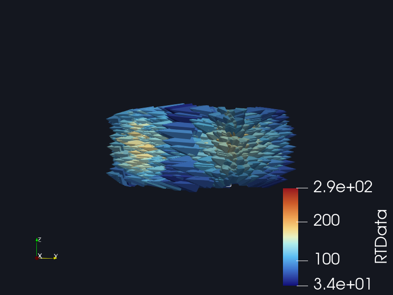
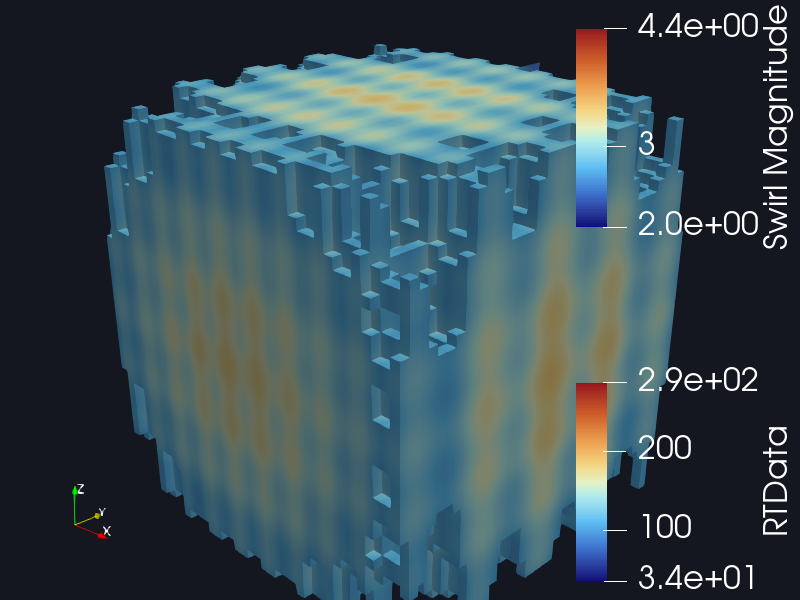
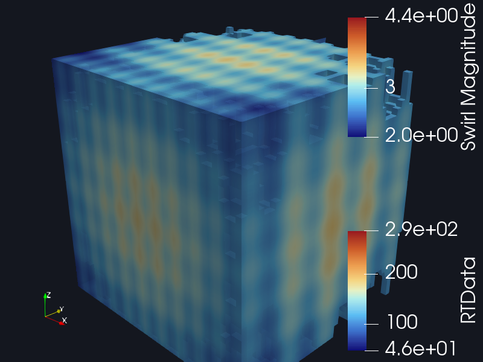

# Demos: driving ParaView through MCP

These are real runs, not mock-ups. Every image below was produced by
`demos/run_scenarios.py`, which acts as an MCP client, connects to the real
`paraview-mcp-server` over stdio, and drives a live ParaView session:

```
run_scenarios.py (MCP client) → paraview-mcp-server → bridge → ParaView
```

Reproduce with:

```bash
python demos/run_scenarios.py
```

**Run of 2026-09-22 — 14/14 scenarios passed, covering all 34 tools bar the three that launch a GUI session.**

| | |
|---|---|
| ParaView | 6.0.1 (MPI, Linux, Python 3.12) |
| Bridge | standalone `pvpython` on `127.0.0.1:9899` |
| Render control | `PARAVIEW_MCP_ALLOW_DETACHED_RENDER_WINDOW=1` |
| Display | `Xvfb` (headless) |

The per-step results of the latest run are in
[`demo-run.md`](demo-run.md), regenerated on every run.

---

## What running them actually found

Three real bugs. Every one of them **passed its assertions** — they showed up
only when the screenshots were looked at, or when the process table was
checked after the run. That is the point of the exercise.

### 1. `paraview_view_set_background` reported success and did nothing

Scenario 03 asks for a dark background. The tool returned
`{"color": [0.08, 0.09, 0.12], "gradient": false}` — success — and the render
came back with ParaView's default grey:

| Before the fix | After the fix |
|---|---|
|  |  |

ParaView ≥ 5.10 renders the **colour palette** background and ignores the
view's own `Background` property unless `UseColorPaletteForBackground` is
cleared. The grey in the left image is exactly the palette default
`[0.384, 0.365, 0.353]`. The handler now opts out of the palette before setting
the colour.

No unit test caught this: the handler *did* set the property it was asked to
set. Only the rendered pixels showed that the property had no effect.

### 2. Filter tools did not say what they created

Scenario 04 contours a dataset, then wants to colour the contour. The contour
tool returned `{"input": "Volume", "filter": "Contour", "values": [80, 150]}` —
with no way to address the object it had just made. An assistant had to guess
`Contour1` or re-list the pipeline and diff it.

All seven filter tools now return the registered `name` of the object they
created, so the next call can use it:

```json
{"name": "Contour1", "input": "Volume", "filter": "Contour", "values": [80.0, 150.0], "shown": true}
```

If the name cannot be determined the call still succeeds with `"name": null` —
the filter worked, and failing the whole operation over a lookup would be worse.

### 3. Cancelling a job left ParaView running forever

Scenario 13 starts a job that sleeps for 600 seconds and cancels it.
`paraview_job_cancel` returned `{"status": "cancelled"}` — and the run finished
with this still on the machine:

```
65613  1989  pvpython /tmp/paraview-mcp-headless-g48l_4t9/wrapper.py
65614 65613  .../pvpython-real /tmp/paraview-mcp-headless-g48l_4t9/wrapper.py
```

`pvpython` is a launcher binary that **forks** `pvpython-real` and waits for
it, rather than exec'ing it. `proc.terminate()` therefore signalled only the
launcher, and the process actually running the script survived — holding CPU,
memory and the stdout pipe indefinitely. The tell was the timing:
`paraview_job_cancel` took exactly 5.01 s, the internal settle timeout, because
the output pipes never closed.

Headless subprocesses are now started with `start_new_session=True` and
signalled as a process group, escalating to `SIGKILL` if the group ignores
`SIGTERM`. The same bug affected the execution *timeout* path, which is fixed
by the same change. After the fix, cancellation takes **0.00 s** and leaves
nothing behind.

This one had no visual symptom at all. It was found because the demo runner
checks the process table after teardown.

### 4. A usability trap worth knowing about

ParaView displays image data as an **Outline** by default, so "open this file
and show me a picture" renders an empty wireframe box:



That is ParaView behaving as designed, not a bug, but it means an assistant
should follow `paraview_source_open_file` with
`paraview_display_set_representation(..., "Surface")` when the user asked to
*see* something. Scenario 02 now does exactly that.

---

## The scenarios

### 02 — Open a dataset and render it

> **Prompt:** Open `demo.vti` and save a picture of it to disk.

```
paraview_source_open_file    → {"name": "XMLImageDataReader1", "shown": true}
paraview_source_rename       → {"old_name": "XMLImageDataReader1", "new_name": "Volume"}
paraview_display_set_representation → {"representation": "Surface"}
paraview_view_reset_camera   → {"reset": true}
paraview_export_screenshot   → {"filepath": "...", "resolution": [800, 600]}
```

Note the name: ParaView registers the reader as `XMLImageDataReader1`, not
`demo.vti`. The tool reports it, and the scenario renames it to `Volume` so the
later steps read clearly.

### 03 — Colour by a scalar array

> **Prompt:** Colour it by the RTData array and rescale the colour map to the data range.


The colour bar reads 3.4e+01 to 2.9e+02, which is the true RTData range of the
Wavelet source — the rescale worked, and the legend proves it rather than the
tool merely claiming it.

### 04 — Extract an isosurface

> **Prompt:** Add a contour of RTData at values 80 and 150, and hide the original volume.



Two nested isosurfaces: blue at 80, red at 150, coloured by RTData, with the
source volume hidden. The colour bar is correctly clamped to `[80, 150]`.

### 05 — Slice and aim the camera

> **Prompt:** Slice the dataset through the origin along X, then look at it from the front.



The camera was placed at `[90, 0, 0]` looking at the origin with `+Z` up. The
orientation axes in the corner confirm it: X points at the viewer, Z is up.

### 06 — Threshold and export

> **Prompt:** Keep only cells where RTData is between 100 and 200, then export that to a .vtu file.

Writes a 3.7 MB `.vtu`, then reads the filter's properties back out of the
pipeline to confirm the range that was applied.

### 07 — The Python escape hatch

> **Prompt:** Report the RTData range and cell count of the dataset.

```json
{"points": 68921, "cells": 64000, "range": [37.354, 276.829]}
```

A second step builds a `Sphere` from Python and displays it with `mcp.show()`,
which no-ops when no render view exists — so the same script is safe under both
bridge modes.

### 08 — Guardrails

> **Prompt:** Try a few things that should fail cleanly rather than corrupt the session.

| Call | Result |
|---|---|
| `source_get_properties(name="NoSuchSource")` | `Source 'NoSuchSource' not found in the pipeline` |
| `display_set_opacity(opacity=4.0)` | `opacity must be between 0.0 and 1.0` |
| `python_exec(transport="sideways")` | `transport must be one of bridge, headless` |
| `python_exec(code="raise ValueError('boom')")` | traceback returned, bridge unaffected |

The scenario then calls `scene_get_info` to prove the session is still healthy
after all four failures.

### 10 — Vector field: glyphs and streamlines

> **Prompt:** Make a vector field from the coordinates, show it with arrows, and trace streamlines through it.

A Calculator builds `coordsY*iHat - coordsX*jHat + 2*kHat` — rotation in XY
with a constant climb in Z. Glyphs show the field directly; the stream tracer
then integrates through it.

| Glyphs | Streamlines |
|---|---|
|  |  |

The streamlines are helices winding around the Z axis, which is exactly what
that field should produce — the picture confirms the maths, not just that the
call returned 200.

### 11 — Clip and tidy up

> **Prompt:** Clip the volume in half along Y, then delete the filters I no longer need.



Exercises `filter_clip`, `display_set_opacity` with a *legal* value (0.85,
against the rejected 4.0 in scenario 08), and `source_delete` followed by a
pipeline listing that proves the source is gone.

### 12 — Export an animation

> **Prompt:** Export an animation of the current scene as a series of frames.

Writes `12-animation.0000.png`; the scenario then checks the frame files exist
on disk rather than trusting the return value.

### 13 — Cancel a job

> **Prompt:** Start a long job, then change your mind and cancel it.

Starts a 600-second sleep, confirms it is running, cancels it, and re-polls to
confirm `cancelled`. The runner then verifies no `pvpython` survived — which is
how bug 3 above was caught.

### 14 — Session status

> **Prompt:** Is the ParaView bridge reachable, and did you start it?

Reports bridge reachability, the auth token file, and `managed: false` because
the bridge was started outside this server. `paraview_session_stop` then
declines cleanly rather than erroring.

### 09 — Async jobs

> **Prompt:** Start a long-running computation in the background and poll it until it finishes.

Returns a `job_id` immediately, then polls `paraview_job_status` until it
reports `succeeded` — about 1.5 s for this workload, in a separate `pvpython`
process that never blocks the MCP server.

---

## Coverage

The 14 scenarios exercise 31 of the 34 tools. The three left out —
`paraview_session_start`, `paraview_session_stop` with a live session, and the
GUI path they drive — launch a full `pvserver` + ParaView GUI, which is not
appropriate to spawn from an automated run. `paraview_session_status` and the
no-op `paraview_session_stop` are covered in scenario 14.

---

## Notes on the setup

The demos opt into `PARAVIEW_MCP_ALLOW_DETACHED_RENDER_WINDOW=1`. The default
standalone `pvpython` bridge refuses render-view control precisely because it
can open a detached window; under `Xvfb` there is no desktop to disturb, and
screenshots are the point of the exercise. For a normal GUI session, start the
in-GUI bridge instead.
